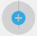

# Formula Templates

Formula templates enable you to create a single template for a formula that you can reuse with withe different elements, different resources, or other inputs. After you create a formula template, you can then create a formula instance where you replace the values and element instances with actual values. This approach helps you build efficient and reusable formulas.

## Build a Formula Template

Formula templates are comprised of a trigger that kicks off the formula, steps that execute as a result of the trigger, and variables to represent input required to run an instance of the formula. You can create formulas that use triggers that are kicked off when something happens to an element instance, you can schedule triggers, or you can manually kick off a trigger. See [Triggers, Steps, and Variables](reference.html) for more information about each component.

As you build a formula, you also build context consisting of triggers, variables, steps, and values created by steps. You can refer to that context in later steps in the formula. Consider each component as a building block that has a name and information that you can refer to. For example, in a formula that sends an email notification when a contact is added, you build the body of the email in one step and refer to the body in a later step when you actually send the message. See [Reference Syntax](#reference-syntax) for way to refer to triggers,



To build a new formula template:

1. Click **Formulas**, and then on the Formulas page, click **Create New Formula**.

3. Click **Create New Formula**.
4. Enter a name for your formula, and then click **Create**.

    {{site.console}} provides you a list of triggers. For details about each trigger, see [Triggers, Steps, and Variables](reference.html).
    

5. Select your trigger.
    * Choose **Event** for a formula triggered by an event configured on an Element.
    * Choose **Element Request** for a formula triggered when a specific API call is made to an element.
    * Choose **Scheduled** for a formula to occur at a specific time or regular interval.
    * Chose **Manual** to trigger the formula with an API call to `POST /formulas/instances/:id/executions`.
6. Complete the trigger properties, which vary based on the selected trigger.
    * For **Event** provide an [Element Instance Variable](reference.html/#formula-variables).
    * For **Element Request** provide an [Element Instance Variable](reference.html/#formula-variables), an API method, and API endpoint.
    * For **Scheduled** provide a [Cron schedule](reference.html/#scheduled).
    * For **Manual** you do not need to provide any additional properties.
7. Click **Save**.

    {{site.console}} shows the first trigger node in the formula visualization.
    

6. Add any variables that you will need to run the formula instance.
  5. Click **Variables**.
  
  6. Select the type of variable and enter a name.

        Takes note of the Formula Step Variable Name, which is how you will [refer to the variable](#reference-syntax) throughout the formula.

  8. Click **Save**.

5. Add your first step. In the formula visualization, click .
6. Select the type of step that you want to add.
7. Complete the step properties, and then click **Save**. For details on each step, see [Element Instance Variable](reference.html/#formula-variables).

    {{site.console}} shows the first trigger node and the step that you just created in the formula visualization. Note that the step nodes include **onSuccess**  and **onFailure**  buttons.
    

7. To add another step, either click **onSuccess**  or **onFailure** , depending on the previous step.
8. Continue adding steps until you complete the formula template.
8. After you complete the formula, [test it](#test-formula-templates).



## Test Formula Templates

You can test a formula template as you build it. When you test a formula template, you can either use an existing formula instance or create a new formula instance.



Find out what happens with show advanced: email and webhook url

To test a formula template:

1. At the top of the formula visualization, click **Setup Test**.

2. Click **Select Instance**.
3. Either choose an existing formula instance (and skip down to the selecting a trigger step) or click **Add New Instance**.
4. Enter a name for the instance.
5. For each variable, click the variable and add an element instance or enter a value.
6. Click **Create Instance**.
7. Select the instance that you just created.
8. Click **Select Trigger**.
9. Provide trigger information, depending on the type of trigger.

## Reference Syntax

You can access values created by steps, variables, and other information available to the formula context with the syntax described in this section.

### Trigger Syntax

The base syntax for triggers is `trigger.`.

Each different type of step produces different step execution values that are added to the formula "context". The formula context is then passed from step-to-step, allowing you to use these values in any subsequent steps in your formula. Below are the different values that each different step type produces:

* trigger.event
* trigger.event.objectType
* trigger.event.eventType
* trigger.event.objectId
* trigger.event.objectType.toLowerCase
* trigger.formula.instance.action
* trigger.args.action
* trigger.args.config
* trigger.args.objectId
* trigger.args.eventType
* trigger.response.body.data.stateAbbreviation
* trigger.body.message.events[0].eventType
* trigger.body.message.raw.changedConversations

### Variables

* $config.

### Steps

* $steps.

## Create Variable

Naming: You can use white space, but we'll smash it together and camelCase it.

## Review Executions

## Managing Large Visualizations

## Transformations

How can I transform data from a trigger?

Ask Greg for a diagram explaining template & instances

## Troubleshooting

Look for events - waited long enough? are events configured on the instance.

## Create Formula Based on Existing Formula
