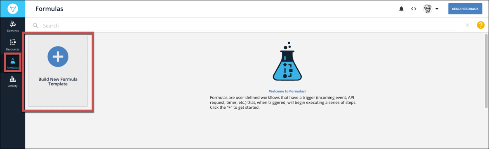
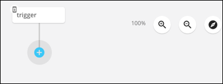
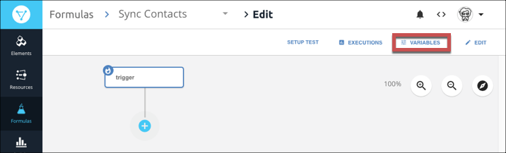
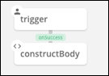

# Formula Templates

Formula templates enable you to create a single template for a formula that you can reuse with different elements and values. After you create a formula template, you can then create a formula instance where you replace the formula variable with actual element instances and values. This approach helps you build efficient and reusable formulas.

{% include callout.html content="<strong>On this page</strong></br><a href=#build-a-formula-template>Build a Formula Template</a></br><a href=#test-formula-templates>Test Formula Templates</a></br><a href=#create-variables>Create Variables</a></br><a href=#edit-and-delete-variables>Edit and Delete Variables</a></br><a href=#review-executions>Review Executions</a></br><a href=#copy-a-formula-template>Copy a Formula Template</a></br><a href=#parallel-executions>Parallel Executions</a></br><a href=#use-a-formula-as-a-resource>Use a Formula as a Resource</a></br><a href=#rename-a-formula-template>Rename a Formula Template</a></br><a href=#add-a-description-to-a-formula-template>Add a Description to a Formula Template</a></br><a href=#delete-a-formula-template>Delete a Formula Template</a></br><a href=#deactivate-a-formula-template>Deactivate a Formula Template
</a>" type="info" %}

## Build a Formula Template

Formula templates are comprised of a trigger that kicks off the formula, steps that execute as a result of the trigger, and variables to represent input required to run an instance of the formula. You can create formulas that use triggers that are kicked off when something happens to an element instance, you can schedule triggers, or you can manually kick off a trigger. See [Triggers, Steps, and Variables](reference.html) for more information about each component.

As you build a formula, you also build context consisting of triggers, variables, steps, and values created by steps. You can refer to that context in later steps in the formula. Consider each component as a building block that has a name and information that you can refer to. For example, in a formula that sends an email notification for a new contact, you build the body of the email in one step. In a later step when you actually send the message, refer to the step where you built the body. See [Reference Syntax](#reference-syntax) for ways to refer to triggers.



To build a new formula template:

1. Click **Formulas**, and then on the Formulas page, click **Create New Formula**.

3. Click **Create New Formula**.
4. Enter a name for your formula, and then click **Create**.

    {{site.console}} provides you a list of triggers. For details about each trigger, see [Triggers, Steps, and Variables](reference.html).
    

5. Select your trigger.
    * Choose **Event** for a formula triggered by an event configured on an Element.
    * Choose **Element Request** for a formula triggered when a specific API call is made to an element.
    * Choose **Scheduled** for a formula to occur at a specific time or regular interval.
    * Chose **Manual** to trigger the formula with an API call to `POST /formulas/instances/:id/executions`.

    

6. Complete the trigger properties, which vary based on the selected trigger.
    * For **Event** provide an [Element Instance Variable](reference.html/#formula-variables).
    * For **Element Request** provide an [Element Instance Variable](reference.html/#formula-variables), an API method, and API endpoint.
    * For **Scheduled** provide a [Cron schedule](reference.html/#scheduled).
    * For **Manual** you do not need to provide any additional properties.
7. Click **Save**.

    {{site.console}} shows the first trigger node in the formula visualization.
    

6. Add any variables that you will need to run the formula instance.
  5. Click **Variables**.
  
  6. Select the type of variable and enter a name.

        Takes note of the Formula Step Variable Name, which is how you will [refer to the variable](#reference-syntax) throughout the formula.

  8. Click **Save**.

5. Add your first step. In the formula visualization, click .
6. Select the type of step that you want to add.
7. Complete the step properties, and then click **Save**. For details on each step, see [Element Instance Variable](reference.html/#formula-variables).

    {{site.console}} shows the first trigger node and the step that you just created in the formula visualization. Note that the step nodes include **onSuccess**  and **onFailure**  buttons.
    

7. To add another step, either click **onSuccess**  or **onFailure** , depending on the previous step.
8. Continue adding steps until you complete the formula template.
9. Add a description by clicking Edit. See [Add a Description to a Formula Template](#add-a-description-to-a-formula-template).
8. After you complete the formula, [test it](#test-formula-templates).



## Test Formula Templates

You can test a formula template as you build it. When you test a formula template, you can either use an existing formula instance or create a new formula instance.



To test a formula template:

1. At the top of the formula visualization, click **Setup Test**.

2. Click **Select Instance**.
3. Either choose an existing formula instance (and skip down to the Select Trigger step) or click **Add New Instance**.
  4. Enter a name for the new formula instance.
  5. For each variable, click the variable and add an element instance or enter a value.
  6. Click **Create Instance**.
  7. Select the instance that you just created.
8. Click **Select Trigger**.
9. Provide trigger information, depending on the type of trigger.

## Create Variables

You can create two types of variables: Element Instance variables that will be replaced by element instances and Value variables that will be replaced by values entered at the formula instance. When you create a variable, note the Formula Step Variable Name which is how you refer to the variable in the formula context. See [Formula Variables](reference.html/#formula-variables) for more about variables in the formula context.

To create a formula variable:

1. Open the formula template. On the Formulas page, hover over the Formula Card, and then click **Open**.
5. Click **Variables**.

2. Select the type of variable to create.
3. Enter a name for the variable. You can include spaces, but spaces are removed to create the Formula Step Variable Name, which is how the variable is referred to in the formula context.
4. Click **Save**.

## Edit and Delete Variables

You can edit the name of a variable or remove a variable from a formula template.



To edit or delete a formula variable:

1. Open the formula template. On the Formulas page, hover over the Formula Card, and then click Open.
5. Click **Variables**.

2. Click **Edit Variable**.
3. Select the variable to edit or delete, and then:
  * Edit the name, and then click **Save**. Or,
  * Click **Delete**.

## Review Executions

You can troubleshoot formulas by reviewing executions. The executions are split into three columns from left to right:

* Formula Executions &mdash; the list of executions of the selected formula template. Failed executions are clearly marked.
* Steps &mdash;The steps in the formula and an indication of their success  or failure .
* values &mdash;The details associated with the selected step.




To review executions

1. Open the formula template. On the Formulas page, hover over the Formula Card, and then click **Open**.
2. Click **Executions**.

3. Click the execution to review.
4. Click the step to review.

## Copy a Formula Template

You can create a formula template based on an existing template or from a Cloud Element sample formula, resulting in a copy of the template.

To create a copy of a formula template:

1. Click **Formulas**, and then on the Formulas page, click **Create New Formula**.

3. Click **Create From Existing Formula**.
  * To use one of your existing formula templates, select the template.
  * To use a Cloud Elements formula template, click CE Sample Formulas, and then select the formula.
4. Enter a name for your formula, and then click **Create**.


## Parallel Executions

To help formula instances execute the formula steps as efficiently as possible, formula instances take advantage of multithreaded executions. That is, multiple steps in a formula instance can make API calls at the same time. Some API providers do not allow multiple API calls from the same account at the same time. If this happens, you can change a formula template or an individual formula instance to execute one step at a time. This makes the formula less efficient and results in an increase in the overall execution time.

To change a formula from the default multithreaded execution to single threaded:

1. Open the formula template. On the Formulas page, hover over the Formula Card, and then click **Open**.
2. Click **Edit**.

3. Click **Show Advanced**.
4. Switch **Single Threaded Execution** on.
5. Click **Save**.

Alternatively, in the formula template or formula instance JSON, update `singleThreaded` to `true`:

```json
{
"singleThreaded": true
}
```

## Use a Formula as a Resource

You can expose formulas with manual triggers as synchronous API calls. This enables you to further remove logic from your applications and also provides the ability to more efficiently chain requests together.

The API calls are synchronous and so a response is required for further processing. To maintain efficiency, Cloud Elements imposes a processing time limit. If the API call reaches that limit, the response notifies you.

To use a formula as an API call:

1. Open the formula template. On the Formulas page, hover over the Formula Card, and then click **Open**.
2. Click **Edit**.

3. Click **Show Advanced**.
4. In **API Method** select the method used to call the formula, such as GET, POST, PUT, PATCH, or DELETE.
5. In **API URI** enter the endpoint for the formula, such as `/formula1`.

To test the API call, you can make the API call yourself or use our API docs. Either way, you must provide a Formula Instance ID. You can find the ID on a Formula Instance Card under the title.

To access the docs for the formula:

1. On the Formulas page, hover over the Formula Card, and then click **API Docs**.
2. On the API Docs page, click **Try it Out**.
2. In **Elements-Formula-Instance-Id** enter a Formula Instance ID, and then execute the API call.

To make an API call to the formula as a resource, include the formula instance (`elements-formula-instance-id`) in the header in addition to the usual User and Organization. For example:

```bash
curl -X GET \
  https://api.cloud-elements.com/elements/api-v2/formula1 \
  -H 'authorization: User <USER_SECRET>, Organization <ORGANIZATION_SECRET>' \
  -H 'elements-formula-instance-id: 28683' \
```

## Rename a Formula Template

To rename a formula template:

1. Open the formula template. On the Formulas page, hover over the Formula Card, and then click **Open**.
2. Click **Edit**.

3. Rename the formula template.
5. Click **Save**.

## Add a Description to a Formula Template

Descriptions provide more information about a formula template. Use the information to describe the formula template use case and anything another user might need when creating a formula instance.

To add a description to a formula template:

1. Open the formula template. On the Formulas page, hover over the Formula Card, and then click **Open**.
2. Click **Edit**.

3. Describe the formula template in **Description**.
5. Click **Save**.


## Delete a Formula Template

You can delete a formula template if the template has no instances associated with it. If the formula template includes instances, [delete those first](formula-instance.html/#delete-a-formula-instance).

To delete a formula template:

1. Navigate to the Formulas page.
2. Hover over the Formula Template card, and then click **Delete**.
3. Confirm the deletion.

## Deactivate a Formula Template

You can deactivate a formula template to prevent any executions of formula instances of the template.



To deactivate a formula:

1. Open the formula template. From the Formulas page, hover over the Formula Template card, and then click **Open**.
2. Click **Edit**.

2. Switch the **Active** slider off.

3. Click **Save**.
