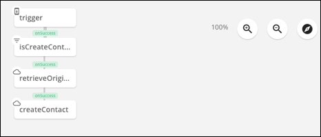
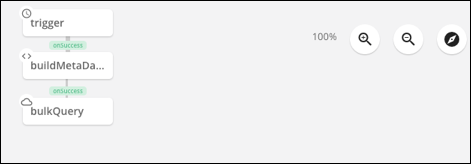
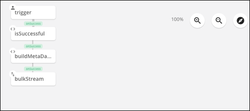

# Formula Template Examples

The examples in this section show a selection of common use cases for formulas. Each example includes a table that identifies the types of triggers, steps, and variables used in the formula. The table also identifies any prerequisites required, like an element with events. Lastly, each example includes a downloadable JSON file that you can use to create your own version of the example template with the `POST /formulas` endpoint.



## CRM to Messages

This example listens for an event on a CRM element and then sends an email with that event information using a messaging element. This example was tested with the [Salesforce Sales Cloud](../../elements/salesforce/) and [SendGrid](../../elements/sendgrid/) elements.

| Trigger | Step Types   | Variable Types | Prerequisites | Template JSON  |
| :------------- | :------------- |:------------- |:------------- | :------------- |
|  [Event] (reference.html#event) |  <ul><li>[JS Script] (reference.html#js-script)</li><li>[Element API Request] (reference.html#element-api-request)</li></ul>  | [Element Instance] (reference.html#formula-variables) | <ul><li>CRM hub element instance with events</li><li>Messaging hub authenticated element instance</li></ul> | [Formula JSON][4]  |

To create a formula that listens for an event and emails a message:

1. [Build a formula template](build-template.html#build-a-formula-template) and select **Event** as the trigger.
2. Because the trigger is a change to a CRM element, add an element instance variable that refers to a CRM element.
  3. Click .
  3. Click **Add New Variable**, and then click **Element Instance**.
  4. Enter a name for your CRM variable. In this example, we'll use `crmElement`.
  5. Click **Save**.
  6. Select the variable that you just created (`crmElement`), and then click **Save** on the Edit event: "trigger" page.

        Your formula visualization should look like the following example:
        

4. Add another element instance variable for the messaging element.
  5. Click **Variables**.
  
  7. Click **Element Instance**.
  8. Enter a name. For this tutorial we'll call it `messagingElement`.
  9. Click **Save**.
5. In the formula visualization, click  to add a step.
6. Create a JS Script step that constructs a message when the trigger happens.
  7. Click **JS Script**.
  8. Enter a name for the script. We'll call it `constructBody`.
  8. Enter a script that constructs a message, such as the example below.

        ```js
        done( {
          "subject": "CRM Event Occurred",
          "to": "receipient@cloud-elements.com",
          "from": "sender@cloud-elements.com",
          "message": `${trigger.event.objectType} with ID ${trigger.event.objectId} was ${trigger.event.eventType}`
        });
        ```
  1. Click **Save**.
1. Create an Element API Request step to send the message that you created in the previous step. Click the **constructBody** step, and then click **Add OnSuccess**.
    7. Select **Element API Request**.
    8. Enter a name for the step. We'll call it `sendEmail`.
    9. In **Element Instance Variable**, click , and then select the **messagingElement** variable that we created earlier.
    9. In **Method**, select **POST** because the formula will submit a POST request to the messaging hub to send an email.
    10. In **API**, enter the API used to send email messages. In this case, enter `/messages`.
    11. Click **Show Advanced**.
    12. Scroll to **Body** and enter the reference to the email that we constructed earlier. In this case, type `${steps.constructBody}`.
    13. Click **Save**.

Your formula should look like the visualization below. It should include a trigger and two steps: the first constructs an email and the second sends a message.


## Add New Contact Created in One System to Another

This example listens for a new contact on one element instance, and then adds the new contact to another element instance.  The trigger for the formula is an Event. When a new contact is created at an element instance that has events set up, the trigger receives a payload with the raw contact information. Because this raw data cannot be used to create the same contact at a different element instance, the formula uses the `objectID` from the trigger to get the transformed contact instead. The formula then posts the transformed contact to the target element instance.

For this example to work, you must [define a common resource](../../guides/common-resources/?resource=organizations) to transform the data received from Salesforce.

This example was tested with the [Salesforce Sales Cloud](../../elements/salesforce/) and [HubSpot CRM](../../elements/hubspot-crm/) elements.

| Trigger | Step Types   | Variable Types | Prerequisites | Template JSON  |
| :------------- | :------------- |:------------- |:------------- | :------------- |
|  [Event] (reference.html#event)  |  <ul><li>[JS Filter] (reference.html#js-filter)</li><li>[Element API Request] (reference.html#element-api-request)</li></ul>  | [Element Instance] (reference.html#formula-variables) | <ul><li>CRM hub authenticated element instance with events</li><li>CRM hub authenticated element instance to sync new contact to</li><li>A common resource that transforms contacts</li><li>A common resource mapped to the origin and destination element instances</li></ul> | [Formula JSON][5]  |

To create a formula that adds new contacts created in one system to another:

1. [Build a formula template](build-template.html#build-a-formula-template) and select **Event** as the trigger.
2. Because the trigger originates from an element instance configured to listen for events, add an element instance variable.
  3. Click .
  3. Click **Add New Variable**, and then click **Element Instance**.
  4. Enter a name for your CRM variable. In this example, we'll use `originInstance`.
  5. Click **Save**.
  6. Select the variable that you just created (`originInstance`), and then click **Save**.

        Your formula visualization should look like the following example:
        

4. Add another Element Instance variable to represent the system to update after you create a contact at the `originInstance`.
  5. Click **Variables**.
  
  7. Click **Element Instance**.
  8. Enter a name. For this tutorial we'll call it `destinationInstance`.
  9. Click **Save**.
10. In the formula visualization, click  to add a step.
6. Create a JS Filter step that checks to be sure the event is a created contact, and not an updated or deleted contact.
  7. Click **JS Filter (true/false)**.
  8. Enter a name for the script. We'll call it `isCreateContact`.
  8. Enter a script that checks to be sure the event was caused by a created object, such as the example below.

      ```js
      let theEvent = trigger.event.eventType;
      let theObject = trigger.event.objectType;

      done((theEvent === 'CREATED') && (theObject === 'Contact' || theObject === 'contacts'));
      ```
1. Create an Element API Request step to retrieve the transformed version of the newly created object based on the `objectId` in the trigger. Click the **isCreateContact** step, and then click **Add OnSuccess**.

    

  7. Select **Element API Request**.
  8. Enter a name. For this tutorial we'll call it `retrieveOriginalContact`.
  9. In **Element Instance Variable**, click , and then select the **originInstance** variable that we created earlier.
  9. In **Method**, select **GET** because the formula will submit a GET request to a common resource.
  10. In **API**, retrieve the transformed newly created contact by entering the endpoint of the common resource and specifying the `objectId` from the trigger. For this tutorial, the common resource is called `myContacts`.

            /MyContacts/${trigger.event.objectId}

  13. Click **Save**.
1. Create an Element API Request step to add the contact to another element instance. Click the **retrieveContact** step, and then click **Add OnSuccess**.
  7. Select **Element API Request**.
  8. Enter a name. For this tutorial we'll call it `createContact`.
  9. In **Element Instance Variable**, click , and then select the **destinationInstance** variable that we created earlier.
  9. In **Method**, select **POST** because the formula will submit a POST request to sync the contact.
  10. In **API**, enter the API to the common resource. For this tutorial, the common resource is called `myContacts`.

            /MyContacts

  11. Click **Show Advanced**.
  12. Scroll to **Body** and enter the reference to the step with the transformed contact data. In this case, type `${steps.retrieveOriginalContact.response.body}`. This inserts the body from the `retrieveOriginalContact` step&mdash;the JSON describing the transformed contact&mdash;in the POST request to the `destinationInstance`.
  13. Click **Save**.

Your formula is finished and should look like the visualization below. It should include a trigger and three steps: the first checks that an event is a created contact, the second gets the transformed contact data, and the third syncs the contact.


## Bulk Transfer CRM Data

Bulk data transfer is a common use case. For example, your first sync between CRM systems or maybe you add many accounts or contacts each day and want a single job to run to sync between systems. This example demonstrates how to use two formulas to complete a bulk transfer.

| Trigger | Step Types   | Variable Types| Prerequisites | Template JSON  |
| :------------- | :------------- |:------------- | :------------- |:------------- |
|  <ul><li>[Scheduled] (reference.html#scheduled) (Formula 1)</li><li>[Manual] (reference.html#manual) (Formula 2)</li></ul> |  <ul><li>[JS Script] (reference.html#js-script) </li><li>[Element API Request] (reference.html#element-api-request)</li><li>[JS Filter] (reference.html#js-filter) (Formula 2)</li><li>[Stream File] (reference.html#stream-file) (Formula 2)</li></ul>  | <ul><li>[Value] (reference.html#formula-variables)</li><li>[Element Instance] (reference.html#formula-variables)</li>  |<ul><li>CRM hub authenticated element instance with events</li><li>CRM hub authenticated element instance to sync new contact to</li></ul> | <ul><li>[Step 1 Formula JSON][6]</li><li>[Step 1 Formula JSON][7]</li></ul>  |

### Formula 1

To create a formula that makes a bulk query and then triggers the second formula that will download and then upload the bulk files:

1. [Build a formula template](build-template.html#build-a-formula-template) and select **Scheduled** as the trigger.
2. Add a cron string to identify when the sync occurs.

    This example fires every Monday through Friday at 1:00 a.m..

        0 0 1 ? * MON,TUE,WED,THU,FRI *

4. Add three variables for the 1) The resource that you want to sync (like `account` or `contact`), 2) The element instance that includes the resources that you want to sync and, 3) The formula instance id associated with the second formula ([Formula 2](#formula-2)) in this process.
  5. Click **Variables**.
  
  7. Click **Value**.
  8. Enter a name for the variable that represents the resource that you want to sync. For this tutorial we'll call it `resourceName`.
  9. Click **Save**.
  10. Repeat to create a Value variable called `stepTwoId`.
  11. Create an Element Instance variable named `originInstance`.
10. In the formula visualization, click  to add a step.
6. Create a JS Script step that builds the metadata for the bulk query, including the CEQL query that requests a specific resource and the callback URL that will be the formula execution endpoint that executes [Formula 2](#formula-2).
  7. Click **JS Script**.
  8. Enter a name for the script. We'll call it `buildMetaData`.

      ```js
      done ({
          "query":{
            "q":"select * from " + config.resourceName
          },
          "headers":{
            "Elements-Async-Callback-Url":"/formulas/instances/" + config.stepTwoId + "/executions"
          }
        });
      ```

1. Create an Element API Request step to make a bulk download query, referencing the query and callback URL created in **buildMetaData**. Click the **buildMetaData** step, and the click **Add OnSuccess**.
  7. Select **Element API Request**.
  8. Enter a name. For this tutorial we'll call it `bulkQuery`.
  9. In **Element Instance Variable**, click , and then select the **originInstance** variable that we created earlier.
  9. In **Method**, select **POST** because the formula will submit a POST request to the resource.
  10. In **API**, enter the endpoint to make a bulk query.

            /bulk/query

  11. Click **Show Advanced**.
  12. In **Headers**, enter the reference to the headers that you built in the script in the `buildMetaData` step. In this case, type `${steps.buildMetaData.headers}`.
  13. In **Query**, enter the reference to the query that you built in the script in the `buildMetaData` step. In this case, type `${steps.buildMetaData.query}`.
  13. Click **Save**.

The first formula should look like the visualization below. It should include a trigger and two steps: the first builds the metadata for a bulk query, and the second makes the bulk query, which includes a callback to the formula execution endpoint of the next formula.


#### Formula 2

To create a formula that receives the notification that the job completes, downloads the file from the original element, and posts to the destination:

1. [Build a formula template](build-template.html#build-a-formula-template) and select **Manual** as the trigger, and then click **Save**.

    

4. Add two element instance variables to represent the element that you are downloading from and the element that you are uploading to, and a variable to represent the resource that you are syncing.
  5. Click **Variables**.
  
  7. Click **Value**.
  8. Enter a name for the variable that represents the resource that you want to sync. For this tutorial we'll call it `resourceName`.
  9. Click **Save**.
  11. Create Element Instance variables to represent the source and target systems to sync. For this example, use `originInstance` and `destinationInstance`.
10. In the formula visualization, click  to add a step.
6. Create a JS Filter step that makes sure that the bulk query is completed.
  7. Click **JS Filter (true/false)**.
  8. Enter a name for the script. We'll call it `isSuccessful`.
  8. Enter a script such as the example below.

      ```js
      let status = trigger.args.status;

      if (status && status === "COMPLETED") {
        done(true);
      } else {
        done(false);
      }
      ```
6. Create a JS Script step that defines an identifier field, which is the unique key for an upsert operation. It also specifies the content type as **csv**. Click the **isSuccessful** step, and then click **Add OnSuccess** .
  7. Click **JS Script**.
  8. Enter a name for the script. We'll call it `buildMetaData`.
  8. Enter a script like the following example:

      ```js
      const metaData = {
        "identifierFieldName":"email"
      }

      const downloadHeaders = {
        "Accept":"text/csv"
      };

      done({
        "metaData": metaData,
        "downloadHeaders": downloadHeaders
      });
       ```
1. Create an Element Stream step to move the files downloaded from the origin instance to the destination instance. Click the **buildMetaData** step, and then click **Add OnSuccess** .
  7. Select **Stream File**.
  8. Enter a name. For this example we'll call it `bulkStream`.
  9. In **Download Element Instance Variable**, click , and then select the **originInstance** variable that we created earlier.
  9. In **Download Method**, enter `GET`.
  10. In **Download API**, enter `/bulk/${trigger.args.id}/${config.resourceName}`. `${trigger.args.id}` gets the id from the payload sent to the trigger by [Formula 1](#formula-1). `${config.resourceName}` refers to the resourceName variable that identifies the resource that you want to sync.
  9. In **Upload Element Instance Variable**, click , and then select the **destinationInstance** variable that we created earlier.
  9. In **Upload Method**, enter `POST`.
  10. In **Upload API**, enter `/bulk/${config.resourceName}`. `${trigger.args.id}`.
  11. Click **Show Advanced**.
  12. In **Download Headers**, enter the reference to the download headers that you built in the script in the `buildMetaData` step. In this case, type `${steps.buildMetaData.downloadHeaders}`.
  13. In **Upload Query**, enter the reference to the upload query that you built in the script in the `buildMetaData` step. In this case, type `${steps.buildMetaData.metaData}`.
  13. Click **Save**.

The second formula should look like the visualization below.


[1]:{{ site.url }}/download/crm-to-messaging-formula.json
[2]:{{ site.url }}/download/crm-to-messaging-formula-instance.json
[3]:{{ site.url }}/download/crm-to-messaging-formula-instance-execution.json
[4]:{{ site.url }}/download/crm-to-message.json
[5]:{{ site.url }}/download/add-new-contact.json
[6]:{{ site.url }}/download/bulk-formula-1.json
[7]:{{ site.url }}/download/bulk-formula-2.json
