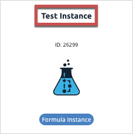

# Formula as a Resource

You can expose formulas that have manual triggers as a resource, known as Formula as a Resource or FaaR. This enables you to use the formula as a synchronous API request.  After you update a formula to be used as a resource, you can make API requests to it at `https://api.cloud-elements.com/elements/api-v2/<resourceName>`. Using a formula as a resource enables you to further remove logic from your applications and also provides the ability to more efficiently chain requests together.

The API requests are synchronous and so a response is required for further processing. To maintain efficiency, Cloud Elements imposes a processing time limit. If the request reaches that limit, the response notifies you.

To use a formula as resource:

1. Open the formula template. On the Formulas page, hover over the Formula Card, and then click **Open**.
2. Click **Edit**.

3. Click **Show Advanced**.
4. In **API Method** select the method used to call the formula, such as GET, POST, PUT, PATCH, or DELETE.
5. In **API URI** enter the resource name of the formula, such as `/formula1`.

To test the formula as a resource, you can make the request yourself or use our API docs. Either way, you must provide a `Formula Instance ID`. You can find the ID on a Formula Instance Card under the title.


To access the docs for the formula:

1. On the Formulas page, hover over the Formula Card, and then click **API Docs**.
2. On the API Docs page, click **Try it Out**.
2. In **Elements-Formula-Instance-Id** enter a Formula Instance ID, and then execute the API call.

To make an API request to the formula as a resource, include the formula instance (`elements-formula-instance-id`) in the header in addition to the usual User and Organization. For example:

```bash
curl -X GET \
  https://api.cloud-elements.com/elements/api-v2/formula1 \
  -H 'authorization: User <USER_SECRET>, Organization <ORGANIZATION_SECRET>' \
  -H 'elements-formula-instance-id: 28683' \
```

## Status Codes



## Work with Parameters

You can pass parameters into formulas as a resource, and then access the results of the response within the context of the formula.

To include a parameter in a formula as a resource:

1. When you make the request, pass the parameter. An example cURL request with a query parameter to the resource called `formula1`, your endpoint would be:

    ```bash
    curl -X GET \
      https://api.cloud-elements.com/elements/api-v2/formula1?<queryParameter> \
      -H 'authorization: User <USER_SECRET>, Organization <ORGANIZATION_SECRET>' \
      -H 'elements-formula-instance-id: 28683' \
    ```
2. Access data returned in the response to the request by using a script step. The data is available through `trigger.args.request.query`.  An example script that passes query data containing an email address to the console would be:

```js
var queryObject = trigger.args.request.query;

function getThatEmailAddress(emailAddressObject){
	console.log(emailAddressObject['email']);
}

done(getThatEmailAddress(queryObject))
```
