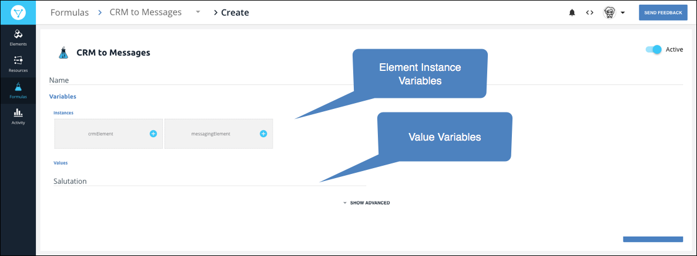
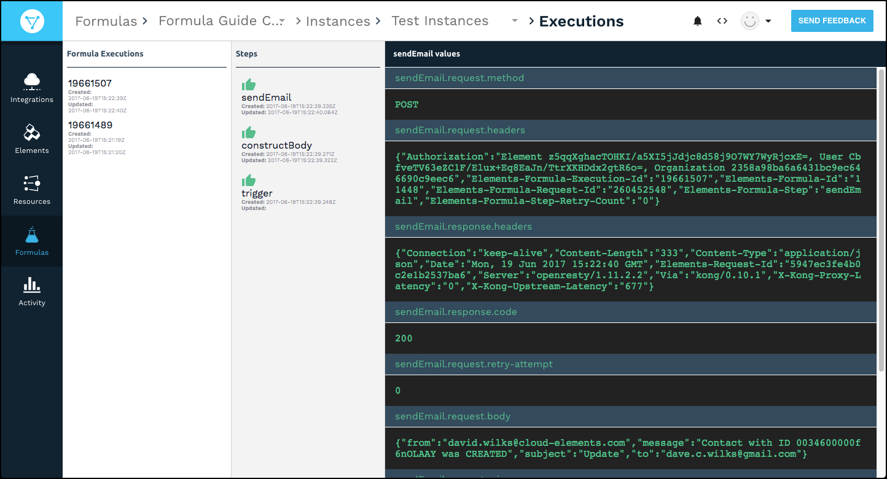

# Formula Instances

In formula instances, you replace the Element Instance and Value variables in the template with specific element instances and values. You can set up formula instances to notify you of any errors through email or a webhook URL.



## Create Formula Instance

To create a formula instance:

1. Navigate to the Formulas page.
2. Hover over the element card, and then click **Create Instance**.
3. Enter a name for the instance.
4. Specify the Element Instance and Value variables:
  * In the **Variables** section under **Instances**,  select an Instance variable, and then choose or create an element instance to replace the variable.
  * In the **Variables** section under **Values**, enter a value to replace the variable.
  
3. To add email or webhook error notifications, click **Show Advanced**.
  * In **Email** enter a comma-separated list of email addresses.
  * In **Webhook URL** enter a comma-separated list of URLs.
4. Click **Create Instance**.

You can create temporary formula instances that exist for a specified amount of time. Specify the time in seconds, such as `86400` for a day or `3600` for an hour. Every hour, Cloud Elements checks for temporary formula instances that have expired and deletes them. You can create temporary formula instances only through the Cloud Elements APIs.

To create a temporary formula instance, add `"formula.instance.time.to.live": <seconds> ` to the `settings` object in a `POST /formulas/{id}/instances` request. Here's an example where the formula instance expires after one hour:

```json
{
  "active": true,
  "configuration": {
    "<key>": "string"
  },
  "settings": {
    "notification.email": "string",
    "notification.webhook.url": "string",
    "api": "string",
    "formula.instance.time.to.live": 3600
  },
  "createdDate": "2018-01-23T16:33:47.431Z",
  "formula": {
    "active": true,
    "id": 0
  },
  "name": "string",
  "updatedDate": "2018-01-23T16:33:47.431Z"
}
```


## Deactivate a Formula Instance

You can deactivate a formula to temporarily stop executions until you reactivate it.



To deactivate a formula instance:

1. Navigate to the Formula instance. On the Formulas page, hover over the Formula card, and then click on the **Instances** banner.
2. Hover over the Formula Instance card, and then click **Edit**.
3. At the top right of the page, switch the **Active** slider off.


## Review Executions

You can troubleshoot formulas instances or review successful executions. The executions appear in three columns from left to right:

* Formula Executions &mdash; the list of executions of the selected formula instance. We identify failed executions in red.
* Steps &mdash;The steps in the formula instance and an icon showing their success  or failure .
* Execution Values &mdash;The details associated with the selected step.


To review formula instance executions:

1. Navigate to the Formula instance. On the Formulas page, hover over the Formula card, and then click on the **Instances** banner.
2. Hover over the Formula Instance card, and then click **Executions**.
3. Click the execution to review.
4. Click the step to review.


## Delete a Formula Instance

To delete a formula instance:

1. Navigate to the Formula instance. On the Formulas page, hover over the Formula card, and then click on the **Instances** banner.
2. Hover over the Formula Instance card, and then click **Delete**.
3. Confirm the deletion.

## Edit a Formula Instance

You can update the following information in a formula instances:

* Name
* Variables
* Notifications

To edit a formula variable:

1. Navigate to the Formula instance. On the Formulas page, hover over the Formula card, and then click on the **Instances** banner.
2. Hover over the Formula Instance card, and then click **Edit**.
  * To edit the name, a Value variable, or any notifications, make your changes, and then click **Update**.
  * To edit an Element Instance variable, click the pencil icon, and then select a new element instance. Click **Update**.

## Find a Formula Instance ID

The Formula Instance ID is a unique identifier for each formula instance. You can see the formula ID on a formula instance card under the title.

