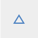
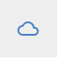
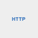
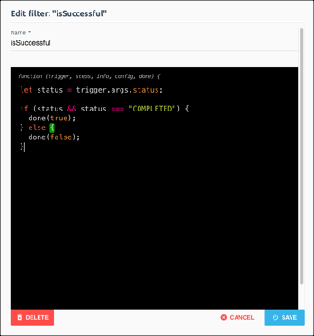
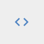
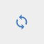
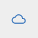

# Triggers, Steps, and Variables





## Triggers

Triggers are the actions that kick off a formula. Triggers can be one of the following types:

* [Event](#event)
* [Element Request](#element-request)
* [Scheduled](#scheduled)
* [Manual](#manual)

### Event 

You can set up triggers that listen for an event to happen on an element instance. To set up this trigger, you must use an Element Instance Variable that, when specified in a formula instance, refers to an element instance that is configured to use webhooks or polling to listen for events.

To set up an Event trigger, you must specify an Element Instance Variable. Click  to find or create a variable to represent the element instance that will kick off a formula instance when an event occurs.

If an Event trigger's Element Instance is set up for polling instead of webhooks, then each object that is found while polling triggers a separate formula execution. For example, if the poller finds five changes, five different formula executions kick off.

To see event triggers in action, see the following examples:

* [CRM to Messages](examples.html)
* [Add New Contact Created in One System to Another](examples.html#add-new-contact-created-in-one-system-to-another)



### Element Request 

Triggered any time a specific API call is made to a given Element Instance. To set up this trigger, you must use an Element Instance Variable that, when specified in a formula instance, refers to an element instance.

When you set up an Element Request trigger, specify the following parameters:

* Element Instance Variable: Click  to find or create a variable to represent the element that will kick off a formula instance when the specified API call occurs.
* Method:  {{site.data.table-desc.formula-method}}.
* API: The endpoint, such as `hubs/crm/contacts`.

### Scheduled 

Triggered at times specified by a Cron job. We recommend that you review the many reference pages for Cron jobs online.



In general, the Cron format consists of:

| Minute  0-59| Hour 0-23   | Day of Month 1-31   | Month of Year 1-12   | Day of Week 1-7 Monday-Sunday   | Year 1900-3000   |
| :------------- | :------------- | :------------- | :------------- | :------------- |:------------- |
|  \*  |  \*  |  \*  |  \*  |  \*  |  \*  |

#### Examples

* Run every 15 minutes

        	0 0/15 * 1/1 * ? *

* Run every Monday at noon

        0 0 12 ? * MON *

* 8.00 PM every weekday (Mon-Fri):

        	0 0 8 ? * MON,TUE,WED,THU,FRI *

* midnight on 1st ,10th & 15th of month

        0 0 0 1,10,15 1/1 ? *

To see a Scheduled trigger in action, see [Bulk Transfer CRM Data](examples.html#bulk-transfer-crm-data)

### Manual 

Triggered via a manual API call to `POST /formulas/instances/:id/executions`. Manual triggers do not require any specific configuration. You can use formulas triggered manually as synchronous API calls. See [Formula as a Resource](faar.html) for setup instructions.

To see a Scheduled trigger in action, see [Bulk Transfer CRM Data](examples.html#bulk-transfer-crm-data)

## Step Types



### ActiveMQ Request 

The ActiveMQ Request (`amqpRequest`) step type uses the AMQP protocol to post a message to an MQ server such as RabbitMQ.

When you set up an ActiveMQ Request step, include the following information:





### Element API Request 

The Element API Request (`elementRequest`) step makes an API call to a specific Element Instance.

To see an Element API Request step in action see:

* [CRM to Messages](examples.html#crm-to-messages)
* [Add New Contact Created in One System to Another](examples.html#add-new-contact-created-in-one-system-to-another)
* [Bulk Transfer CRM Data](examples.html#bulk-transfer-crm-data)

When you set up an Element API Request step, include the following information:





### HTTP Request 

The HTTP Request (`httpRequest`) step make an HTTP/S call to any URL/endpoint.

When you set up an HTTP Request step, include the following information:





### JS Filter 

Use the JS Filter (true/false) (`filter`) step to write custom Javascript that *must* return true or false. As with all steps, you must include a name. See [Javascript in Formulas](javascript.html) for more information about working with Javascript in formulas.

Use JS Filter steps to specify only certain event types, field values, or other information. You can also use filters to split formulas into different paths.

* If a filter returns `true`, the formula executes the left, or OnSuccess , step.
* If a filter returns `false`, the formula executes the tight, or OnFailure , step.

To see a JS Filter step in action see:

* [Retrieve, Transform, and Sync Contact](examples.html#add-new-contact-created-in-one-system-to-another)
* [Bulk Transfer CRM Data](examples.html#bulk-transfer-crm-data)



### JS Script 

Use the JS Script (`script`) step to write custom Javascript that *must* pass a valid JSON object to the `done` callback. As with all steps, you must include a name. See [Javascript in Formulas](javascript.html) for more information about working with Javascript in formulas.

Use JS Script steps to build objects to use in request steps for query parameters or the request body.



To see a JS Script step in action see:

* [CRM to Messages](examples.html#crm-to-messages)
* [Bulk Transfer CRM Data](examples.html#bulk-transfer-crm-data)



### Loop Over Variable 

Use the Loop Over Variable (`loop`) step to loop over a list of objects from a previous step or trigger. Set `onSuccess` to the first step in the loop. When you have reached the last step in the loop set the onSuccess field to the loop step, this will restart the loop for the next object. If you need to continue on after the loop is completed, set `onFailure` to the next step to execute after the loop is completed. For a loop step, `onFailure` is executed when the loop has been executed for all objects in the list.

When you set up a Loop Over Variable step, include the following information:





### Platform API Request 

The Platform API Request (`request`) step makes an API call to one of our platform APIs.

When you set up a Platform API Request step, include the following information:





### Retry Formula on Failure 

Retry Formula on Failure (`retryFormulaExecution`) retries a formula instance execution with the same input data. You can configure the number of retry attempts, with a maximum of 7 attempts. The retry time is set based upon an exponential backoff in minutes. The equation used for the exponential backoff is `round(e^x)` where `x` is the retry attempt number.

When you set up a Retry Formula on Failure step, include the following information:





### Stream File 

Stream File (`elementRequestStream`) steps move a file from one Element Instance to another. Stream Files steps configure two API requests instead of just one. One request downloads the date from an element instance, and the second request uploads the data to another. Use the response body of the download request as the request body of the upload request.

To see a Stream File step in action see [Bulk Transfer CRM Data](examples.html#bulk-transfer-crm-data).

When you set up a Stream File step, include the following information:





### Sub-Formula 

Sub-Formula (`formula`) steps run another formula instance.

When you set up a Sub-Formula step, include the following information:





## Formula Variables

Formulas include two types of variables that you must specify when you run a formula instance:

* Element Instance Variable: A variable that is replaced by a specific element when you run a formula instance.
* Value Variable: A variable that is replaced by a configurable value when you run a formula instance.

Formula variables are limited to the formula and cannot have the same name. However, you can name variables in different formulas with the same name like "originInstance" or "destinationInstance."

### Formula Variable Scope

Formula variables contribute to the formula context and you refer to them by their Formula Step Variable Name. This name is always `config.variableName`. So, if you create an Element Instance Variable called `originInstance`, you refer to it as `${config.originInstance}`. A Value Variable called `objectName` is referred to as `${config.objectName}`.
