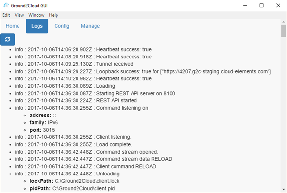
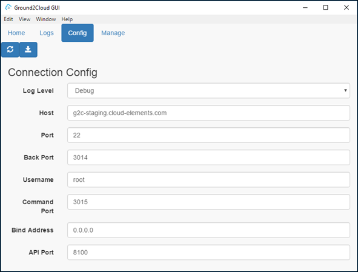
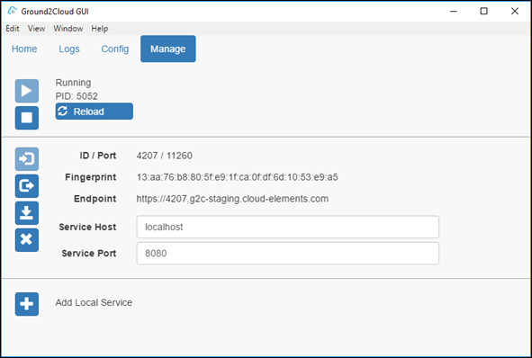

# Manage Ground2Cloud

After installing Ground2Cloud, you can access the Ground2Cloud GUI through the desktop shortcut (if you created one) or by finding Ground2Cloud in your programs. Use the Ground2Cloud GUI to manage your Ground2Cloud installation and as a valuable source of debug information in case you need to contact Cloud Elements support. Whether the GUI is open or closed, the Ground2Cloud service is always running, so you can access or cluse the Ground2Cloud GUI any time.

The Ground2Cloud GUI includes four tabs Home, Logs, Config, and Manage described in the following sections.

## The Home Tab

The Home tab includes basic information about the application and, most importantly, an indication of the status of your installation. In the image above, the sentence at the bottom indicates "You are up to date." Your installation should always be up to date because Ground2Cloud updates in the background. If the message is different, you should contact Cloud Elements support.

### The Logs Tab

The Logs tab shows the latest logs generated by Ground2Cloud. You can view the logs to see how Ground2Cloud Client is performing, or to see if there are any errors that might be the cause of problems. Click **Refresh** to update the page and show the latest logs.

### The Config Tab

The Config tab lets you view and edit your Ground2Cloud configuration. You should generally not edit this information yourself unless instructed by Cloud Elements. Clicking refresh reloads the current configuration, and clicking Save will save your new values.

### The Manage Tab

The Manage tab allows you to stop and start; register and unregister; and link and unlink your Ground2Cloud installation. (Note: not all Ground2Cloud GUIs have link/unlink capabilities). You generally should not use these features unless instructed by a Cloud Elements engineer.
