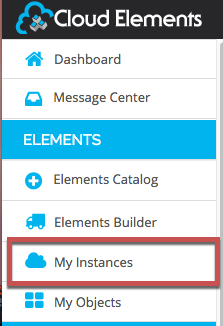
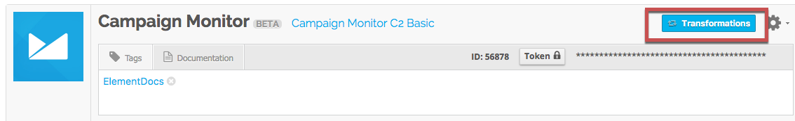
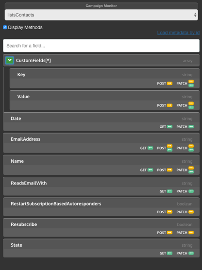



# First Time Using Element Mapper
To get started using Element Mapper, you can use the Element Mapper UI or our platform object definition/transformation APIs.  If you are just getting started, we would recommend using the UI to help familiarize yourself with the different pieces that make up Element Mapper and how they work.

# Using Element Mapper UI

This guide is here to get you up and running with Element Mapper. We have provided step by step visual directions, as well as, a video of the same instructions taking you through the whole process. Watch the Video or read at your own pace.

This guide reviews the minimum number of steps to get you mapping your data with the leading Cloud Services using Element Mapper. If you have not signed up for Cloud Elements Service or authenticated an Element with us, see [the Getting Started Guide](/docs/quickstart/overview.html).




## What you will need:

* Cloud Elements Account
* A Provisioned CRM Element (Salesforce, SugarCRM, ZohoCRM)

Don’t have that set up?
Check out [the Getting Started Guide](/docs/quickstart/overview.html) to get set up.

*Salesforce will be used for this demonstration*

## What we’ll do:

1. [Access transformations](#access-transformations).
2. [Create an account object](#create-an-account-object).
3. [Map fields to the account object](#map-fields-to-the-account-object).
4. [View the object](#view-the-object).

### Access transformations

2. Sign in to your account at Cloud Elements
3. Once you are logged in to the Cloud Elements, click **My Instances**.

3. Click **Transformations** for the elment that you want to use.

### Create an account object

1. Select an Object. We’ll use the Account Object as the example.
2. Click **New Object**.

3. Name the Object, e.g. “myAccounts”.



### Map fields to the account object

4. Drag and drop some Fields to map to the object “myAccounts”.

5. Click the pencil to edit the object fields.

6. Name the field – assign custom value e.g. “myName”.
7. (Optional) Select Yes or No to “ignore unmapped” fields.
  * Yes gives you the flexibility to map only the fields you wish to the object.
  * No gives you the option to map the custom fields of your choice and all available fields for the object within the Endpoint (Salesforce in our example).

8. OR you may click “Add Field” to map fields manually. This option gives you the power to create nested objects – meaning you can create a myAddress Object and map only the fields you wish to add, e.g. BillingStreet, BillingCity, BillingState.
  * Name the Object e.g. “myAddress”.
  * Select type e.g. “object”.
  * Name Field to Map e.g. “Address”.
  * Click the green check mark to complete the action.
  
8. Drag and drop the fields you wish to nest underneath the object.

9. Assign values to each of the fields
  * Name the Object e.g. “myBillingState”.
  * Select type e.g. “string”.
  * Select Field to Map e.g. “BillingState”.
  * Click the green check mark to complete the action.
  
10. (Optional) Select the Level you wish to map the transformation with.
  * Organization = Your Company Level.
11. Select “Transformation Level”.
  * Instance Level = Only for one Salesforce Connection.
  * Organization Level = Your Company Level.
  * Account Level = A customer of your Company.
12. Click **Save**.
13. Click “X”

### View the object

14. To view your Object, click **Documentation**.

15. Scroll down towards the bottom of the window to ” GET /{objectName}” and click the link

16. Scroll down to Parameters.
17. Input the name of the Object you created, e.g. “myAccounts”.
18. Click **Try It Out**.

19. View Mapped Objects.

##### CHECKPOINT

__What we did:__

* Signed in to Cloud Elements.
* Created an object.
* Mapped fields to the object.
* Viewed the object.

Don’t stop there, keep exploring the other functionality that Element Mapper has to offer by creating more custom objects with different Element Endpoints like HubSpot, QuickBooks and more.

If you have any questions, please contact us at [support@cloud-elements.com](mailto:support@cloud-elements.com)

We will do our best to get back to you within 24 hours. Your success is our success.

Thanks for reading.

The Cloud Elements Team
