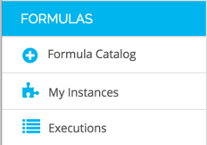
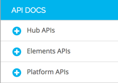

## Console Tour

### Element Catalog

After logging into Cloud Elements, you will see our Elements Catalog.  This list contains all of the leading cloud services that we have enabled through our platform.  Don’t see an Element you need?  Build it yourself through our Element Builder!

### Menu Items

Along the left hand side, you will see the different features of our platform:

#### _Elements_

Here you can view the Element Catalog, the Element Instances you have provisioned, your Common Objects used in Transformations, and a link to Element Builder.

#### _Formulas_

The Formulas section allows you to view the Formula Catalog (workflow templates you have built), the Formula instances you have set up, and a log of all Formula executions.

#### _Monitor_

The Monitoring section contains areas for you to view logs of all activity within the Cloud Elements Platform.  Additionally, you can view the polling cron jobs you have set up for your Element instances, and the event payloads those jobs pick up

#### _Administration_

The Admin section allows you to manage a list of accounts, users and sub-users.  This is useful if you are building an integration that you will sell to your customers.  This section will allow you to view and manage your customer logins.

#### _Cloud Elements APIs_

Cloud Elements believes in APIs first.  Everything you can do in our UI is available through a uniform API. This section breaks down each of our platform APIs in RESTful Swagger documentation.

