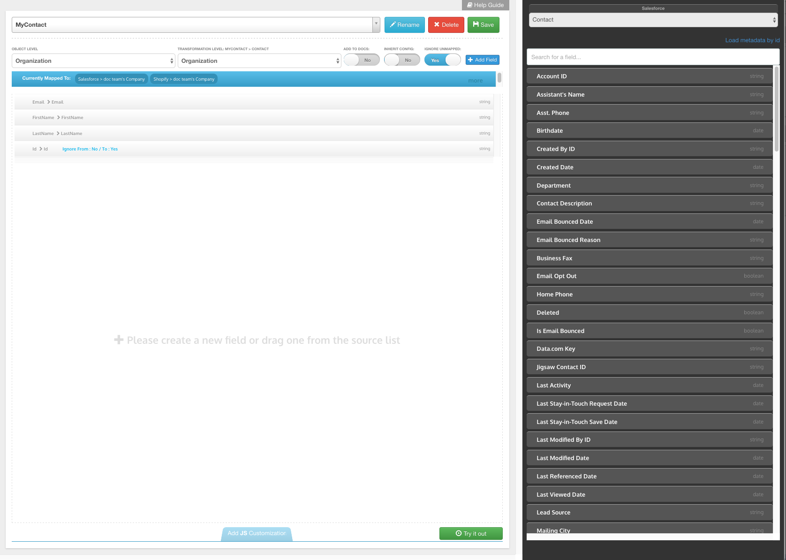
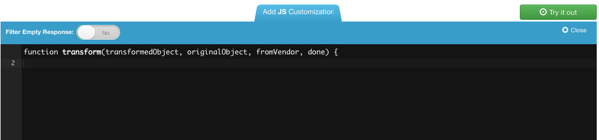
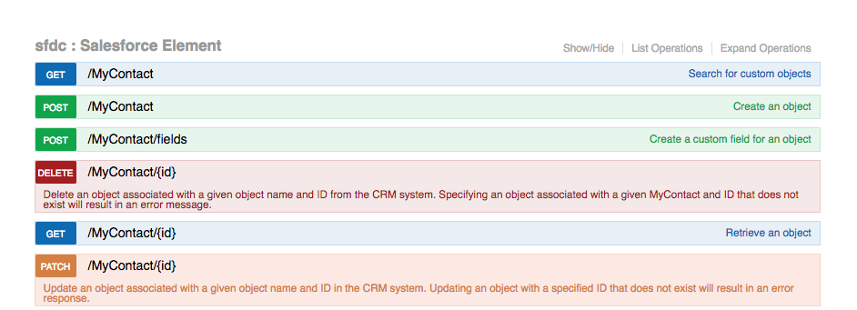
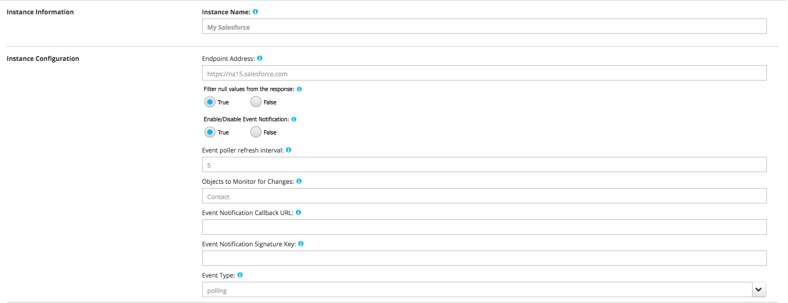
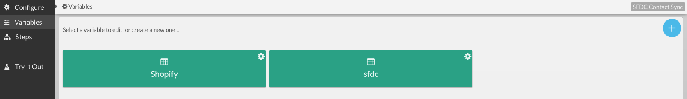
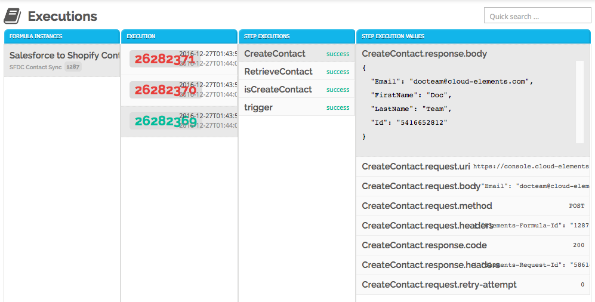

## Creating Your First Integration

To help guide you through the Cloud Elements platform, we will build an example integration. Our use case will be to sync new Contacts from Salesforce to Shopify Customers.

__NOTE:__ if you have not reviewed our [Definitions section](definitions.html), please do so before viewing this guide.

#### Create Element Instances

Since our integration will consist of Salesforce and Shopify, we need to create Element instances of both.

We will begin with Salesforce.

From the Elements Catalog, find Salesforce in the CRM Hub and click `Add Instance`.

Since Salesforce uses OAuth Authentication, the instance setup screen doesn’t require a lot of information. For now, we can simply give our instance a name and click Next.

Once provisioned, you can see your new Salesforce Element instance under My Instances in the Elements Menu.  If you click the Documentation tab of the instance, you are presented with the RESTful Swagger API docs that allow you to make live API calls to Salesforce.

For Shopify, our Instance configuration looks like this:

Since our example Formula is just one-directional from Salesforce, we don’t need to enable `Events` for Shopify.  If we conducting doing bi-directional syncs, then we we would enable `Events`.







#### Transformations

One of the most powerful features of the Cloud Elements platform is the ability to create Transformations on the data you receive from an Element.  

Data Transformation is the processing of data from one format, such as XML or SOAP, or even currencies and time formats, into another. First, create a common resource (like ``/myContacts``) with only the fields you are interested in. Then, once you map those fields to the vendor-specified fields from an Element (like ``/Contacts`` in Salesforce), you create a Transformation.

For our integration, we will create a new common resource called ``/MyContact`` and map those fields to `Salesforce /Contact` and `Shopify /Customer`

### Creating a Transformation

The first step when creating a new transformation is to click the `TRANSFORMATION` button on one of your Element instances.

This will open our Data Mapper utility screen where you can create your common resource (which we are calling ``/MyContact``) with the fields you are interested in.

In our example, we’ve created the ``/MyContact`` resource with 4 fields:

* Email
* First Name
* Last Name
* Id

We have then mapped those 4 fields of our common resource to the corresponding fields in a `Salesforce /Contact`.

Our Transformation Engine has other powerful, built-in features, like specifying field types, sub-object support, and a custom javascript engine to support any custom requirements you may need.

When we have finished creating our Transformation, we can add it to the Swagger docs to help see the data being returned.

We also want to map our common ``/MyContacts`` resource to `Shopify /Customer`.  Following the same process as Salesforce, our mappings look like this:







### Formulas

Formulas are the automated workflows you can build to sync data between Elements. Formulas start with a Trigger, or event that starts the workflow. Whether or not a specific integration needs a Formula depends on several factors, but as a rule of thumb, if data needs to be synced automatically, it’s best done with a Formula.

At a high level, Formulas are constructed of multiple API calls to Elements.  To sync Contacts, our sample Formula will follow these basic steps:

* Check if `Contact` has been created, and ignore updated contacts
* ``GET /Contacts/{id}`` from Salesforce
* `POST /Contact`

For a more detailed explanation, let’s discuss each step in our example Formula.

#### Trigger

Every Formula begins with a trigger. When creating your formula from scratch, you will be presented with the different trigger types we support:

Since we want to automatically sync `Contacts` when they are created, we will build our Formula off of an Event trigger.  The Event is configured in our Element instance.  For Salesforce, we set up our Salesforce instance to poll `Contacts` every 5 minutes. When new or updated contacts appear in Salesforce, our Event framework builds a payload that can trigger a Formula

#### Variables

One of your first steps is to define variables for your Source and Target Element instances. We strongly recommend that you do not write directly to an Element as that removes some of the ease of reusing Formulas for multiple Elements.  By setting our Source and Target Element instances as variables, we can use this Formula to sync `Contacts` for multiple, different integrations.

### Formula Steps

Formulas are built by adding a series of “steps” to create a natural logic flow. For our `Contact` Sync, let’s discuss each step we used after our trigger.

#### `IsCreateContact` (Filter Step)

After our trigger fires and we get an event payload, we want to filter out any contact that isn’t newly created.

To do that, we add a simple Javascript step to only grab `CREATED` contacts.

With every step, we then define the next step on a success, or perhaps one on failures.

#### `RetrieveContact` (Element Request Step)

The Element Request step performs a simple API call to an Element instance. In our example, since we defined our Source instance as a variable, we call the variable name here instead of an Element instance name.

The Method line is the actual API call to be made (`GET`, `POST`, `PATCH`, etc).

The API line defines the path for the API call. Here, we are using our `/MyContact` common resource. Salesforce lives in our CRM Hub, so that’s the path for our common resource. The last section of a path retrieves the `objectId` field of the event payload. Since we are getting contacts, this line will give us the id of the `Contact` that has just been created in Salesforce.

Putting all this together, the actual API call of this step is `GET /hubs/crm/MyContact/{id}` on our Salesforce Instance

#### `CreateContact` (Element Request Step)

Now that we have the newly created `Contact` details, we need to `POST` that contact as a Shopify customer. For that, we need another Element Request Step to perform a `POST`.

Here, you can see that again, we are using the variable we defined for Shopify, as well as setting a `POST` Method.  The API call uses our common `/MyContact` resource, though this time it’s in the eCommerce Hub since we created a Transformation to Shopify, which lives in the eCommerce Hub.

Lastly, you’ll notice the Body field is populated. `POST` API calls always require a body and here, we are defining it as the result of our `RetrieveContact` step (in other words, our `Get /MyContact/{id}` API call).

Since we’ve defined the model for a Shopify customer in our Transformation, we can simply `POST` the result from our previous `GET` statement and our Transformation model handles the rest.

### Creating Formula Instances

Before we can use the Formula we just created, we have to create an instance of it.  This process defines the variables we have set up in our Formula template.  For us, we need to define our source and target Element instances.

For our example, we first name our instance. This can be anything. You can also see the two variables we created for our Source and Target Elements. The dropdowns allow you to select specific Element instances from those you have already created.

The last section allows you to enter an email address to get notified of any Formula failures via an alert.

#### Formula Executions

Once your Formula instance is provisioned, every time the Formula runs, a log of its execution is recorded.

For a single execution you can see each step of the Formula and whether or not that step succeeded or failed.

For failures, you can select a step and see the response body from the element to help debug and troubleshoot any issues.







For more Quickstart videos, follow the link below:

[Cloud Elements Quickstart Videos](https://www.youtube.com/playlist?list=PLnYyHIetdmCIWu0LGWiMmm89gkKvC7MgU)
