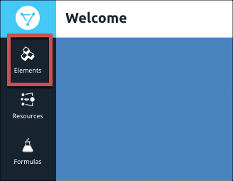

# Set Up Your First Integration

In this Getting Started Guide, we'll walk you through the steps to integrate your contacts in Salesforce with your customers in Shopify. The data sync use case is a simple example that demonstrates the power of Cloud Elements. We'll set up your  <a href="#" data-toggle="tooltip" data-original-title="{{site.data.glossary.element}}">elements</a>, create a  <a href="#" data-toggle="tooltip" data-original-title="{{site.data.glossary.common_resource}}">common resource</a> to transform the data into what we need, and then we'll set up a  <a href="#" data-toggle="tooltip" data-original-title="{{site.data.glossary.formula-template}}">formula</a> to automatically perform the sync.

The three steps in this process are:


##  Authenticate an Element Instance



The first step in setting up our contact sync from Salesforce to Shopify, is to authorize the Salesforce and Shopify elements to cnnect to your accounts. To do so, you will authenticate  <a href="#" data-toggle="tooltip" data-original-title="{{site.data.glossary.element-instance}}">element instances</a> of both Salesforce Sales Cloud and Shopify. We'll walk you through a simple authentication below, but if you want more information take a look at the Element Guides for [Salesforce](../elements/salesforce-service-cloud/authentication.html) and [Shopify](../elements/shopify/authenticate.html).

### Create a Salesforce Sales Cloud Instance

To authenticate a Salesforce Sales Cloud instance:

1. Navigate to the Elements Catalog. From anywhere in the application, click **Elements** on the left side.

1. In the Elements Catalog, search for Salesforce Sales Cloud.

4. Hover over the element card, and then click **Authenticate**.

- From the Elements Catalog, find Salesforce in the CRM Hub and click `Add Instance`.
- Enter any value into `Instance Name` (like "Salesforce Instance 1") field.
- To set up automatic contact sync, enable events for this instance:
  - Set `Enable/Disable Event Notification` to true
  - Set `Event poller refresh interval` to `4`, this will set the poller to check every 4 minutes
  - Set `Objects to Monitor for Changes` to `Contact`, this will set the poller to monitor the Contact objects for changes.
  - Set the `Event Type` to `polling`
- Login to your Salesforce Account.

Once provisioned, you can see your new Salesforce Element instance under My Instances in the Elements Menu.  If you click the Documentation tab of the instance, you are presented with the RESTful Swagger API docs that allow you to make live API calls to Salesforce.

 
### 2. Create a Shopify Instance
Creating a Shopify Instance Requires a few more configuration values in order to provision.

- `shopaddress` this is the name of your Shopify account
- `username` your shopify username
- `password` your shopify password

Since our example Formula is just one-directional from Salesforce, leave `events` disabled for this Shopify Instance.

Once you have entered the fields above, click Next.

##  Map to a Common Resource

dasfklkdsalf;k

##  Build a Formula
