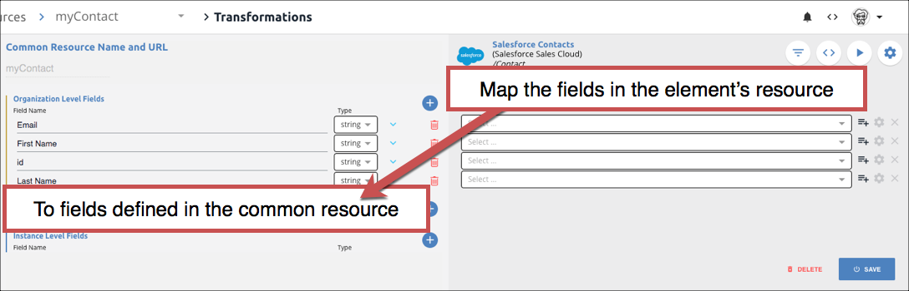
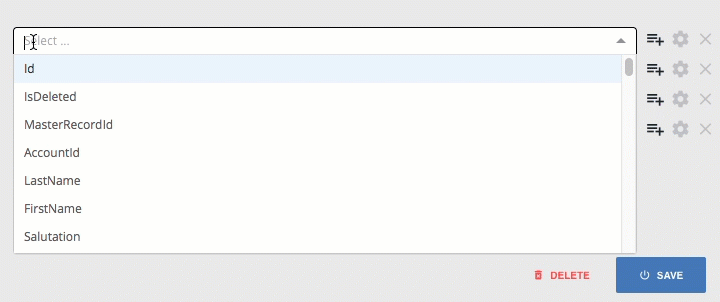
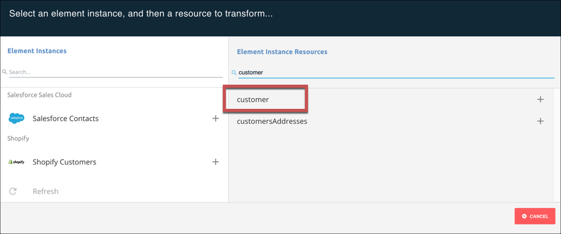
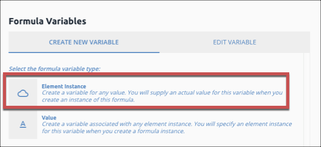

# Set Up Your First Integration

In this Getting Started Guide, we'll walk you through the steps to integrate your contacts in Salesforce with your customers in Shopify. The data sync use case is a simple example that demonstrates the power of Cloud Elements. We'll set up your  <a href="#" data-toggle="tooltip" data-original-title="{{site.data.glossary.element}}">elements</a>, create a  <a href="#" data-toggle="tooltip" data-original-title="{{site.data.glossary.common_resource}}">common resource</a> to transform the data into what we need, and then we'll set up a  <a href="#" data-toggle="tooltip" data-original-title="{{site.data.glossary.formula-template}}">formula</a> to automatically perform the sync.

The four steps in this process are:



##  Authenticate Element Instances



The first step in setting up our contact sync from Salesforce to Shopify, is to authorize the Salesforce Sales Cloud and Shopify elements to connect to your accounts. To do so, you will authenticate  <a href="#" data-toggle="tooltip" data-original-title="{{site.data.glossary.element-instance}}">element instances</a> of both Salesforce Sales Cloud and Shopify. We'll walk you through a simple authentication below, but if you want more information take a look at the Element Guides for [Salesforce Sales Cloud](../elements/salesforce-service-cloud/authentication.html) and [Shopify](../elements/shopify/authenticate.html).



### Authenticate a Salesforce Sales Cloud Instance

In this step you will authenticate an element instance with Salesforce Sales Cloud. As part of that authentication, you will enable events so Cloud Elements can monitor any additions or changes to your list of contacts.

To authenticate a Salesforce Sales Cloud instance:

1. Navigate to the Elements Catalog. From anywhere in the application, click **Elements** on the left side.

1. In the Elements Catalog, search for Salesforce Sales Cloud.

4. Hover over the element card, and then click **Authenticate**.


    The Authentication page includes the fields you need to complete on the left and a code view on the right. When you start building our APIs into your app, you can use this code view to help integrate our APIs in your code. You can see the steps to authenticate by using our APIs in [the Salesforce Sales Cloud Element Guide](../elements/salesforce-service-cloud/authentication.html).

    Because authentication between Cloud Elements and Salesforce Sales Cloud is done using OAuth 2.0, all you need to do is provide a name for the instance and set up events. After you finish, you'll authorize Cloud Elements access to your Salesforce account.

5. In **Name** enter a descriptive name for the instance. For this tutorial, we'll call it "Salesforce Contacts".

    

7. Click **Events Enabled**.
8. In **Event Type**, select **Polling**. We also offer webhooks for Salesforce Sales Cloud, but it requires more setup.
9. For this tutorial, leave **Event Notification Callback URL** and **Callback Notification Signature Key** empty. When you start integrating our APIs in your apps, you'll use these fields to receive event notifications and to add enhanced security.
11. In **Objects to Monitor for Changes** enter `Contact`.
12. Change the `Event poller refresh interval` to 4. This sets the poller to check every 4 minutes.

    Your authentication configuration should look like the example below. Notice that the configuration is also reflected in the code view.
    

13. Click **Create Instance**.
14. As part of the OAuth 2.0 process, log in to Salesforce and allow the connection to Cloud Elements.

After you authenticate the element instance we suggest that you test it out using the API docs. Click **Test in the API** docs, open `GET /contacts`, click **Try it out**, and then click **Execute**. The response body includes all of the contacts in your Salesforce account.

When you finish testing, move on to authenticate with Shopify.

### Authenticate a Shopify Instance

In this step you will authenticate an element instance with Shopify. Because this example creates a one-directional sync from Salesforce to Shopify, you do not need to configure events.

To authenticate a Shopify instance:

1. Navigate to the Elements Catalog and search for Shopify.
4. Hover over the element card, and then click **Authenticate**.

    Like Salesforce, Cloud Elements also uses OAuth 2.0 to authenticate with Shopify, but you also need to configure your **Shopify Site Address**. Because each element has its own authentication requirements, make sure you check out the Element Guides like [Shopify's Element Guide](../elements/shopify/authenticate.html).

5. In **Name** enter "Shopify Customers".
5. In **Shopify Site Address** enter the personalized portion of your `myshopify.com` URL. For example, for `https://cloud-elements.myshopify.com` just enter `cloud-elements`.
13. Click **Create Instance**.
14. Log in to Shopify, and then click **Install unlisted app**.

Like the Salesforce Sales Cloud instance, we suggest that you test Shopify out using the API docs. Click **Test in the API** docs, open `GET /customers`, click **Try it out**, and then click **Execute**. The response body includes all of the contacts in your Salesforce account.

With two authenticated instances, you're now ready to map the Salesforce `/contacts` object and the Shopify `/customers` object to a common resource that you define and that contains only the data you want.

##  Map to a Common Resource



To move a contact from Salesforce to Shopify, we need to map the Salesforce `/Contact` object and the Shopify `/customer` object to a **common resource**: {{site.data.glossary.common_resource}} We'll help you set up a common resource below, but if you want more information take a look at [Defining Common Resources & Transformations](../guides/common-resources/index.html).



### Define a Common Resource

To define a common resource:



3. In Field Name, enter `Email`.
4. Repeat to create the following fields:
  - `Last Name`
  - `First Name`
1. Click **Save**.

Your myContact common resource should look like the example below. Notice that you can now create a transformation on the right side of the page. We'll do that next in [Map and Transform Salesforce Contacts](#map-and-transform-salesforce-contacts).


### Map and Transform Salesforce Contacts

Now that you created a common resource, you'll map fields in the Salesforce `/Contact` object to the common resource. After you map the fields, Cloud Elements transforms the data from Salesforce to match the fields in the common resource.

To map fields and transform the data:

1. Click **Create New Transformation for "myContact"**.

    The two authenticated element instances that you created in Step 1 appear on the left side of the list.
    

2. Click **Salesforce Contacts**.

    The Salesforce resources &mdash; or objects &mdash; available to you appear on the right side. Salesforce has many resources, but instead of scrolling through the list we'll search.

3. In Search type `contact`.
4. Click the **Contact** resource in the list.


    Back on the Transformations page you see the fields in the `myContact` common resource on the left and empty fields to map on the right.
    

5. In the first empty field type `email`. The list filters the fields until you can select the **Email** field, like the example below.

6. Repeat to map the following fields:
  - `First Name` map to `FirstName`.
  - `id` map to `Id`
  - `Last Name` map to `LastName`

    Your mapping should match the the example below:
    

1. Click **Save**.
2. To be able to test the mapping and transformation in the API docs, switch the API docs on: Click , switch on **Add to API Docs**, and then click **Save**.

    

1. Test it out: Click .

    On the **Transformed** tab, you see a payload with just the fields that you defined in the common resource.
    

1. As a comparison, click **Original** to see the payload before Cloud Elements transformed it.
2. Click **Cancel** to return to the Transformations page.

Now that you mapped the Salesforce `/Contact` object to your `myContacts` common resource, let's map the Shopify `/customers` resource.

### Map and Transform Shopify Customers

To map the fields in the Shopify `/customer` object, we just need to repeat the steps that you just completed for your authenticated Shopify instance.

To map fields and transform the data:

1. From the Transformations page with the mapped Salesforce Contacts instance, click **/myContact** in the **My Resources** list.


    The Salesforce Contact instance that you just mapped appears in the **Mapped Transformations** section.
    

1. Click **Create New Transformation for "myContact"**.
2. This time, click the **Shopify Customers** instance on the left, and then locate and select the **customer** resource on the right.

3. Map the fields to:
  - `Email` map to `email`
  - `First Name` map to `first_name`
  - `id` map to `id`
  - `Last Name` map to `last_name`
4. Click **Save**.
5. Switch on the API docs: Click , switch on **Add to API Docs**, and then click **Save**.

    

1. Test it out: Click .

Like the Salesforce element, your response includes only the fields defined in your common resource.


##  Build a Formula



In Cloud Elements you can build **formula templates** &mdash; reusable workflow templates that are independent of API providers. Formula templates include triggers, like events or schedules, that kick off a series of steps. Formulas support a large variety of different use cases across different services.  For example, they can keep systems in sync, migrate data between systems, or automate business workflows.

For this tutorial, you'll create a formula template that:

1. Kicks off when you update a contact.
2. Checks to see if the contact is new or if it was updated (which it will ignore).
3. Gets the contact your Salesforce Sales Cloud element instance and posts it to your Shopify instance.

Before we start, it's important to understand the difference between a formula template and a formula instance. The template defines how the formula works regardless of variables like the kind of element or a user input. With formula instances you plug actual values into the variables in the template. With this approach you can plug different element instances into the formula so you can sync contacts with Hubspot, Woocommerce, Zoho, Etsy, Magento, or any of our elements.

If you want to see a completed formula template for comparison, [download our sample copy][1], and then import it.




### Set Up the Formula Triggers and Variables

The trigger used in a formula template is the action that kicks off the formula. You can set up triggers for events, scheduled jobs, API requests to elements, and manual triggering. Variables can represent authenticated element instances or values. When you actually run a formula by creating a formula instance, you replace the variables with actual authenticated element instances or values.

For this tutorial, the trigger will be based on an event &mdash; when a new contact is created in Salesforce. The variables will represent the Salesforce Sales Cloud and Shopify element instances that you created earlier.

To set up triggers and variables:

1. Navigate to the Formulas page. From anywhere in the application, click **Formulas** on the left side.
1. On the Formulas page, click **Build New Formula Template**.

    You can build formula templates based on existing templates or by importing a JSON file that defines the template. For this tutorial, you will build the formula template from scratch. However, if you want to test your formula with ours, [download our copy][1], and then import it later.

3. Click **Build New Formula**.
4. Enter a name for your formula like "Sync Contacts", and then click **Create**.

    {{site.console}} provides you a list of triggers. Triggers define how the formula starts. Because we want to automatically sync contacts when our event framework discovers a new `/Contact`, we'll use an Event trigger. When new or updated contacts appear in Salesforce, our Event framework builds a payload that can trigger a Formula.
    

5. Click **Event**.

    As mentioned earlier, formula templates consist of variables. The variables can represent authenticated element instances or values. In this formula, the variables will represent the two element instances that you authenticated earlier. Because you have not yet created a variable you need to create one to represent the element that kicks off the formula.

6. Click the add button .
7. On the Formula Variables window, click **Add New Variable**, and then  click **Element Instance**.
8. Name the variable that represents the element that kicks off the template **OriginInstance**. In our example, this will be Salesforce Sales Cloud.

    The variable should look like the example below:
    

9. Click **Save**.
10. Select the variable that you just created **OriginInstance**, and then on the **Edit event: "trigger"** window click **Save**.
7. Now add a variable for the element that gets updated when a contact is created (Shopify): Click **Variables** in the menu bar.

7. Click **Element Instance**.

5. Name the variable **DestinationInstance**, and then click **Save**.

At this point you built a template based on an Event trigger with two variables to represent the origin and destination elements. Next, add the steps needed to perform the sync.

### Add Steps to the Formula Template

In addition to triggers and variables, formula template include steps that represent actions that the formula needs to take to accomplish its goal. At the end of every step, the formula can follow an On Success or On Failure path. For this tutorial, all steps will follow the On Success path. The steps we'll add include:

1. Create a Filter.
2. Retrieve the contact.
3. Create a new contact.

To add steps:

1. Under the trigger click .

    You can use many different kinds of steps in a formula. Because we're going to write some logic to make sure that the event we receive is for a created contact, we'll use the JS Script step type.

2. Click **JS Script**.
3. Enter a name for the step like "IsCreateContact".
3. In the code area, enter the following, and then click **Save**.

    ```js
    let theEvent = trigger.event.eventType;
    let theObject = trigger.event.objectType;

    done((theEvent === 'CREATED') && (theObject === 'Contact' || theObject === 'contact'));
    ```

4. Now add the next step to retrieve the created contact from the element represented by the `OriginInstance` variable &mdash; Salesforce Sales Cloud. Click the **IsCreateContact** step that you just created, and then click **Add OnSuccess**.

5. This time select the **Element API Request** step type. With this type of step, you need to identify the element variable to request and what the endpoint should be.
6.  In the **Add Formula Step** window, enter the name for the step: "RetrieveContact".
7. In Element Instance Variable click , and then select **OriginInstance**.
8. In **Method**, select **GET**.
9. In **API** enter `/hubs/crm/myContact/${trigger.event.objectId}`. This is the endpoint of the Common Resource that you created earlier.

    

10. Click **Save**.
11. Now create the final step, which is posting the created contact to the element represented by the destination variable &mdash; Shopify. Create another Element API Request with the information below:

| Field | Value |
| :------ | :------ |
| Name | `CreateContact` |
| Element Instance | `config.destinationinstance` |
| Method | `POST` |
| API | `/hubs/ecommerce/myContact` |
| Body | `steps.RetrieveContact.response.body`</br>
 |

You are almost done. Now we just need to create and run a formula instance to see the actual sync occur.

##  Create a Formula Instance



The formula instance actually performs the sync. In this case we're going to associate the Salesforce Sales Cloud element instance with the `OriginInstance` formula variable, and Shopify with `DestinationInstance`. Whenever you create a new contact in Salesforce, the Cloud Elements poller recognizes that an even occurred. The trigger for the formula kicks off when an event occurs at the element in the `OriginInstance` variable, which then kicks off the logic in the formula.

To create a formula instance:

1. Navigate back to the main Formulas page.
2. Hover over the **Sync Contacts** card, and then click **Create Instance**.
3. Name the instance something more specific than the template like "Salesforce to Shopify Contact Sync."
5. Click`OriginInstance`, and then select the Salesforce instance that you authenticated earlier &mdash; Salesforce Contacts.
5. Click`DestinationInstance`, and then select the Shopify instance that you authenticated earlier &mdash; Shopify Customers.

    You're formula instance should look like the example below.
    

7. Click **Create Instance**.


## Try it Out

1. Log in in your Salesforce account and create a new contact.
2. Wait a few minutes &mdash; remember that we set the polling interval for five minutes &mdash; and return to Cloud Elements.
2. On the Formulas page, hover over the **Sync Contacts** card, and then click **Executions**.
3. The executions appear on the left side, listed by Object ID. You can click the Execution itself to see the series of steps, and you can get even more detailed by click ing on each step.
6. Lastly, log in to Shopify to see the new Customer that has been created in your account.

Congratulations! You created your first integration. Email [documentation@cloud-elements.com](mailto:documentation@cloud-elements.com) if you have any feedback on this tutorial.

[1]:{{ site.url }}/download/Sync-Contacts.json
