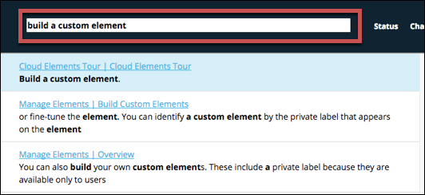

# Getting Started

We're glad that you're trying out Cloud Elements and hope you use this section to get familiar with the application. In this section, we'll give you some basic information to acquaint you with Cloud Elements, and then show you how to integrate the Salesforce and Shopify elements so you can sync your contacts between the two.



## Documentation and Resources

If you have found your way to this page, you're at least familiar with our documentation. We have many resources available to help you create integrations. Here in the Developer Portal, you can find API reference documentation, guides that provide detailed instructions, a link to Cloud Elements University, and documentation about each of our elements &mdash; {{site.data.glossary.element}}

Use **Search the docs** at the top of the page to find information anywhere in the Developer Portal. As you type, matching topics appear with your search term in context. Just click one to jump right to the topic.

As you use the Developer Portal, and especially as you work through the Getting Started guide, we encourage you to provide feedback via the **Docs Feedback** button, or just email us at [documentation@cloud-elements.com](mailto:documentation@cloud-elements.com).

## Definitions

### API Hub

{{site.data.glossary.hub-full}}

We normalize our API calls for all endpoints, to enable calls between services e.g., Salesforce to HubSpot. However, with this feature, certain endpoint resources cannot be mapped for each hub.

* Hubs provide uniform APIs to access any collection of elements or a set of resources.
* Hubs enable “One-to-Many” access to an entire category of services.
* Hubs are accessed using a consistent RESTful API with a JSON payload regardless of the technology used at the endpoint.
* Hubs rapidly translate calls into the semantic and data structure required by each endpoint.
* Hubs provide a uniform set of interactive API documentation that developers use to access the resources in the Hub.
* Hubs combine resources from multiple categories providing a consistent set of APIs and documentation to access any collection of resources (e.g., combine Salesforce, Box, and QuickBooks API resources into a Hub).

### Authenticated Element Instance

{{site.data.glossary.element-instance-full}}

### Bulk API

{{site.data.glossary.bulk-full}}

### CEQL

{{site.data.glossary.ceql-full}}

### Common Resource

{{site.data.glossary.common-resource-full}}

### Discovery Service

{{site.data.glossary.discovery-service}}

### Element

{{site.data.glossary.element-full}} For example, Salesforce Sales Cloud has APIs that many other CRM services do not support. You can find these APIs that are specific to just Salesforce in the documentation for that Element

* Elements share common services including discovery, search query, pagination, bulk uploading and downloading, logging, and interactive documentation.
* Methods are normalized and accessible through RESTful APIs.
* Complete data payloads are returned in JSON and available to transform and normalize to a common resource.
* Cloud Elements keeps each element up-to-date with changes at the endpoint.
* Each elements is a multi-tenant connector supporting an unlimited number of authenticated accounts with no additional code required.

### Endpoint

{{site.data.glossary.endpoint-full}}

### Event

{{site.data.glossary.event}}

### Formula Instance

{{site.data.glossary.formula-instance}}

### Formula Template

{{site.data.glossary.formula-template-full}}

### OAuth Proxy

{{site.data.glossary.oauth-proxy}}

### Payload

{{site.data.glossary.payload}}

### Resource

{{site.data.glossary.resource}}

### Transformation

{{site.data.glossary.transformation-full}}

* Overview
  - Documentation
  - Definitions
* Manage Your Profile
* Cloud Elements Tour
* Build Your First Integration
*
