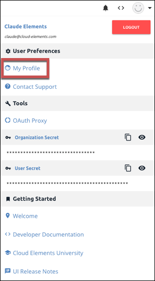

# Manage Your Profile

Your profile includes the basic information about yourself, like your name and email. It also includes critical information that you need to interact with Cloud Elements including your password and user secret.

## Access and Update Your Profile

To access your profile, open the User Profile menu at the top of the page, and then click **My Profile.** To make any changes, update the information, and then click **Update**.

## Change Your Password or User Secret

Use your profile to change your password or get a new user secret. To reset passwords for users who do not access Cloud Elements 2.0, the organization administrator must [use the APIs](user-managementAPI.html#update-a-user).

To reset your password:

* Enter your old and new password on the User Profile page, and then click **Change Password**.

To reset a user secret:

* On the User Profile page, click **Reset User Secret**.
