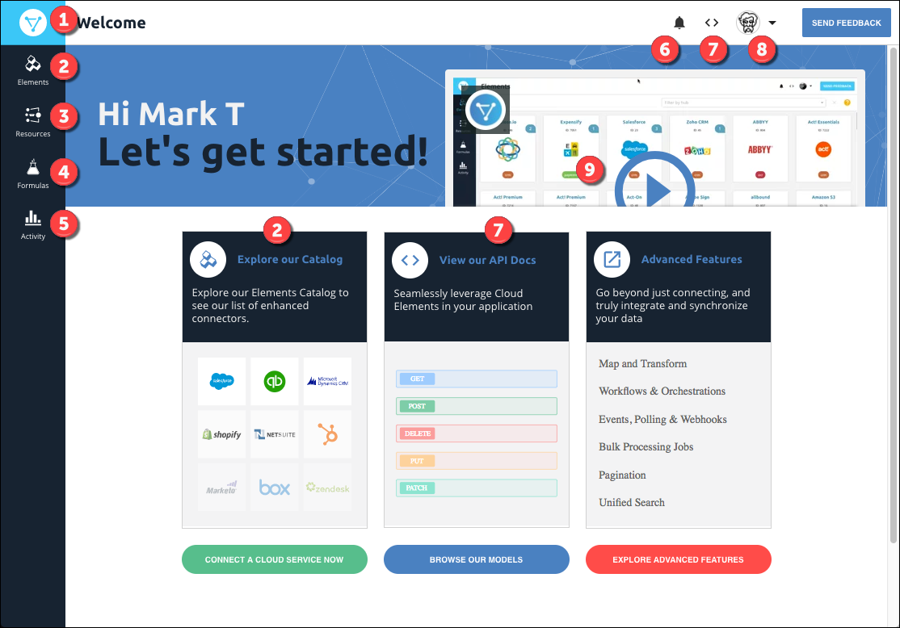

# Cloud Elements Tour

Take a look at the information below to get familiar with Cloud Elements.

 Wherever you are in Cloud Elements, click to return to the Welcome page.

 Visit the Elements Catalog to see the list of  <a href="#" data-toggle="tooltip" data-original-title="{{site.data.glossary.element}}">elements</a>, our enhanced connectors. See [Elements Catalog](#elements-catalog) below for more.

 Define a  <a href="#" data-toggle="tooltip" data-original-title="{{site.data.glossary.common_resource}}">common resource</a>, map fields to it, and  <a href="#" data-toggle="tooltip" data-original-title="{{site.data.glossary.transformation}}">transform</a> your API provider data. See [Common Resources and Transformations](#common-resources-and-transformations) below for more.

 Build a  <a href="#" data-toggle="tooltip" data-original-title="{{site.data.glossary.formula-template}}">formula template</a> and manage individual  <a href="#" data-toggle="tooltip" data-original-title="{{site.data.glossary.formula-instance}}">formula instances</a>. See [Formulas](#formulas) below for more.

 See system logs and review metrics. See [Elements Catalog](#elements-catalog) below for more.

 Review any system alerts and messages. See [Activity](#activity) below for more.

 Get to know our APIs through our interactive API docs. See [API Docs](#api-docs) below for more.

 Access profile information including your accounts and access credentials, contact support, or learn something in our developer documentation, Cloud Elements University, or Release Notes.

 Get familiar with the application through a brief introductory video.

## Elements Catalog

The Elements Catalog provides a list of the API providers available in Cloud Elements.  If you don’t see an element that you need, you can build one yourself. If you're ready to learn all about elements, take a look at [Manage Elements](../guides/elements/index.html) in the Guides on the left.

 Search for an element by name.

 Build a custom element.

 Interact with elements through its element card. Authenticate an instance with the API provider, see the API docs, export the element, or add your own resources to an element.

 See how many authenticated element instances that you connected to the API provider.

 Labels tell you more about the element: the hub that it is in, if it's beta, and if it is a custom element (private).

 Get help about what you see on the page.

## Common Resources and Transformations

The Common Resources > Transformations page shows your common resource on the left, and how you mapped fields from an element resource (the API provider) on the right. When you're ready to define your own common resource and map it to one of your API providers, go to [Defining Common Resources & Transformations](../guides/common-resources/index.html) in the Guides on the left.

 Define a new common resource.

 Access the common resources that you already defined.

 Define a common resource based on an existing common resource, a Cloud Elements template, or a resource at the API provider.

 On the left side, define the fields in the common resource.

 On the right side, map fields in the API provider's resource to the fields you defined in the common resource.

## Formulas

The Formulas page shows all of your formula templates and enables you to create a new template or set up a formula instance. See [Building Formulas](../guides/common-resources/index.html) in the Guides on the left for detailed instructions.

 Build a formula template.

 Use the formula card to open the template and view it or make changes, export the template as a JSON file, or create an individual instance of the formula.

 See how many instances you have of each formula.

## Activity

The Activity page is the central location to monitor your logs and metrics.

 Search for a specific log entry or metric.

 Filter the results by company, date, and time.

 Select what activity you'd like to monitor.

## API Docs

Everything you can do in Cloud Element, you can accomplish with a uniform API. You can view each of our endpoints and make requests with the interactive documentation.

 Select any of our platform APIs to interact with Cloud Elements and manage accounts, work with our elements, formulas, and hubs, or even create a custom element.

 See how we normalize resources in each of our hubs. Select an authenticated instance within the hub to try out the requests.

 View our interactive API docs.

 What the button says: select a resource and try it out. In this case, you'll authenticate an element instance.
