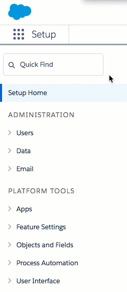
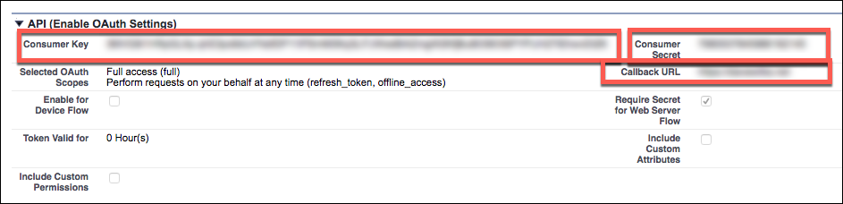

# Service Provider Setup

To authenticate a {{page.heading}} element instance you must have the {{page.heading}} Enterprise edition or Professional edition with API support. Also, to set up a new application in {{page.heading}}, you must have Administrator privileges. Contact your system administrator if you do not have those privileges.

Use the first paragraph to specify any important information about what type of account is needed or if there are any requirements about the type of software.

If there is nothing special to say, just use the following paragraph:

To authenticate a {{page.heading}} element instance, complete the setup steps described in this section.



To set up the service provider: The steps are going to differ widely. Try to only use screen shots where necessary, but by the end of the steps, the user should have the information needed to authenticate an instance with the service provider.

1. Via a web browser, log in to your Salesforce account:
  * Sandbox: [https://test.salesforce.com/](https://test.salesforce.com/)
  * Production: [https://login.salesforce.com/](https://login.salesforce.com/)
1. If not already on the Setup page, [navigate to it](https://help.salesforce.com/articleView?id=basics_nav_setup.htm&type=0).
2. In the menu on the left, click __Apps__, and then click __App Manager__.

2. Click __New Connected App__.
3. Complete the Basic Information section.
4. In the API (Enable OAuth Settings) section, select __Enable OAuth Settings__.
5. Enter a Callback URL to redirect the user to after authentication. This URL will be in your application’s address space, and you will be required to retrieve some information returned on this URL by the endpoint.
6. In __Selected OAuth Scopes__, add the scopes needed from Available to Selected.
      
8. Complete the remaining settings as needed for your app.
8. Click __Save__ at the bottom of the window.
9. Click __Continue__.
9. Note the following in the API (Enable OAuth Settings) section, which you will need to authenticate a Cloud Elements Salesforce element instance with Salesforce.
 * Consumer Key
 * Consumer Secret
 * Callback URL

Next [authenticate an element instance with {{page.heading}}](authenticate.html).
